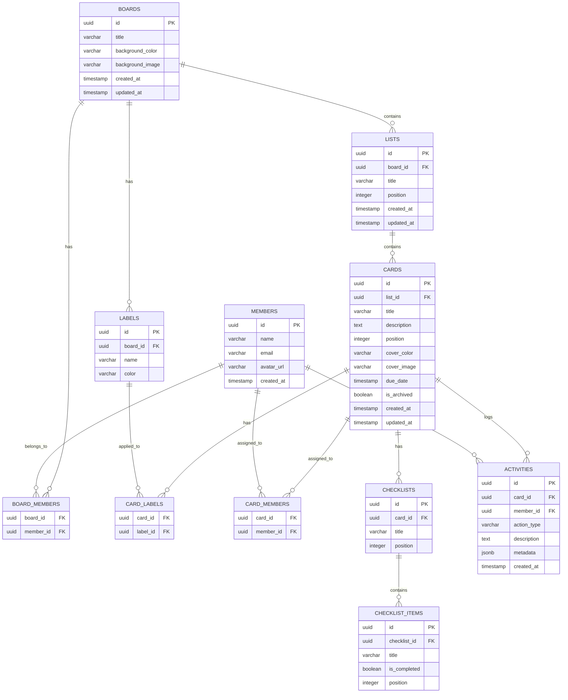
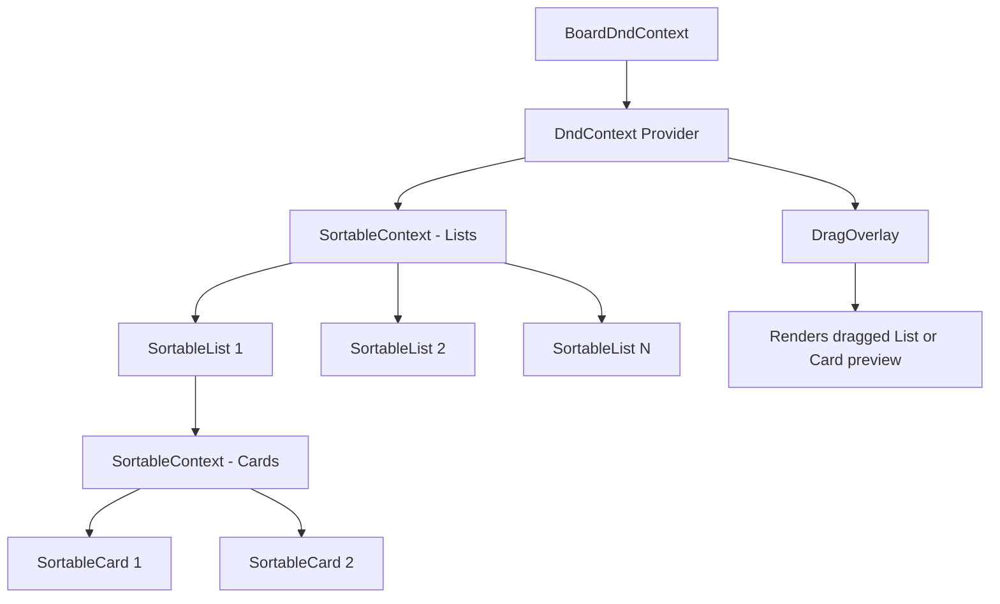

# Trello Clone — Implementation Plan

## Overview

Build a full-stack Kanban-style project management tool that closely replicates Trello's design and UX. The app allows users to create boards with lists and cards, organize tasks via drag-and-drop, and manage workflows visually.

**Tech Stack:**
- **Frontend:** Next.js 16 (App Router) + TypeScript + TailwindCSS (already scaffolded)
- **Backend:** Express.js + TypeScript
- **Database:** PostgreSQL on Neon DB
- **Drag & Drop:** `@dnd-kit/core` + `@dnd-kit/sortable`
- **Deployment:** Vercel (frontend) + Render/Railway (backend)

> [!NOTE]
> No authentication required — a default user is assumed. Sample members are seeded in the DB for assignment features.

---

## 1. Database Schema Design (PostgreSQL / Neon)

This is the core of the application. All entities map directly to Trello concepts.



### Key Schema Decisions

| Decision | Rationale |
|---|---|
| `position` (integer) on lists, cards, checklist items | Enables drag-and-drop reordering. Uses gap-based numbering (1000, 2000, 3000…) to minimize position recalculations |
| `uuid` primary keys | Avoids sequential ID exposure, works well with distributed systems and Neon |
| `is_archived` on cards | Soft delete — cards can be restored |
| `jsonb metadata` on activities | Flexible storage for action context (e.g., "moved from list X to list Y") |
| `cover_color` / `cover_image` on cards | Card cover support (bonus feature) |
| `background_color` / `background_image` on boards | Board background customization (bonus feature) |
| Separate `labels` table per board | Matches Trello — each board has its own label set |

---

## 2. Backend Architecture (Express.js + TypeScript)

### Project Structure

```
backend/
├── src/
│   ├── config/
│   │   └── database.ts          # Neon PG pool setup
│   ├── controllers/
│   │   ├── boards.controller.ts
│   │   ├── lists.controller.ts
│   │   ├── cards.controller.ts
│   │   ├── labels.controller.ts
│   │   ├── checklists.controller.ts
│   │   ├── members.controller.ts
│   │   └── activities.controller.ts
│   ├── routes/
│   │   ├── index.ts             # Route aggregator
│   │   ├── boards.routes.ts
│   │   ├── lists.routes.ts
│   │   ├── cards.routes.ts
│   │   ├── labels.routes.ts
│   │   ├── checklists.routes.ts
│   │   └── members.routes.ts
│   ├── services/
│   │   ├── boards.service.ts
│   │   ├── lists.service.ts
│   │   ├── cards.service.ts
│   │   ├── labels.service.ts
│   │   ├── checklists.service.ts
│   │   └── members.service.ts
│   ├── middleware/
│   │   ├── errorHandler.ts      # Global error handler
│   │   └── validateRequest.ts   # Zod validation middleware
│   ├── utils/
│   │   └── ApiError.ts          # Custom error class
│   ├── db/
│   │   ├── schema.sql           # Table creation DDL
│   │   └── seed.sql             # Sample data insertion
│   ├── app.ts                   # Express app config
│   └── server.ts                # Entry point
├── .env                         # DATABASE_URL, PORT
├── package.json
└── tsconfig.json
```

### API Endpoints

#### Boards
| Method | Endpoint | Description |
|--------|----------|-------------|
| `GET` | `/api/boards` | List all boards |
| `POST` | `/api/boards` | Create a board |
| `GET` | `/api/boards/:id` | Get board with all lists, cards, labels, members |
| `PUT` | `/api/boards/:id` | Update board (title, background) |
| `DELETE` | `/api/boards/:id` | Delete board |

#### Lists
| Method | Endpoint | Description |
|--------|----------|-------------|
| `POST` | `/api/boards/:boardId/lists` | Create a list |
| `PUT` | `/api/lists/:id` | Update list title |
| `DELETE` | `/api/lists/:id` | Delete list |
| `PUT` | `/api/lists/reorder` | Batch update list positions (drag-and-drop) |

#### Cards
| Method | Endpoint | Description |
|--------|----------|-------------|
| `POST` | `/api/lists/:listId/cards` | Create a card |
| `GET` | `/api/cards/:id` | Get card with full details (labels, members, checklists, activity) |
| `PUT` | `/api/cards/:id` | Update card (title, description, due date, cover, archive) |
| `DELETE` | `/api/cards/:id` | Delete card |
| `PUT` | `/api/cards/reorder` | Move/reorder cards (within list or across lists) |

#### Labels
| Method | Endpoint | Description |
|--------|----------|-------------|
| `GET` | `/api/boards/:boardId/labels` | Get all labels for a board |
| `POST` | `/api/boards/:boardId/labels` | Create a label |
| `PUT` | `/api/labels/:id` | Update label |
| `DELETE` | `/api/labels/:id` | Delete label |
| `POST` | `/api/cards/:cardId/labels/:labelId` | Add label to card |
| `DELETE` | `/api/cards/:cardId/labels/:labelId` | Remove label from card |

#### Checklists
| Method | Endpoint | Description |
|--------|----------|-------------|
| `POST` | `/api/cards/:cardId/checklists` | Create checklist |
| `PUT` | `/api/checklists/:id` | Update checklist title |
| `DELETE` | `/api/checklists/:id` | Delete checklist |
| `POST` | `/api/checklists/:checklistId/items` | Add checklist item |
| `PUT` | `/api/checklist-items/:id` | Update item (title, toggle completion) |
| `DELETE` | `/api/checklist-items/:id` | Delete item |

#### Members
| Method | Endpoint | Description |
|--------|----------|-------------|
| `GET` | `/api/members` | Get all members |
| `POST` | `/api/cards/:cardId/members/:memberId` | Assign member to card |
| `DELETE` | `/api/cards/:cardId/members/:memberId` | Remove member from card |

#### Search & Filter
| Method | Endpoint | Description |
|--------|----------|-------------|
| `GET` | `/api/boards/:boardId/search?q=...&labels=...&members=...&dueDate=...` | Search & filter cards |

### Neon DB Connection

```typescript
// src/config/database.ts
import { Pool } from 'pg';

const pool = new Pool({
  connectionString: process.env.DATABASE_URL,
  ssl: { rejectUnauthorized: false },
  max: 10,
  connectionTimeoutMillis: 5000,
});

pool.on('error', (err) => console.error('Unexpected idle client error', err));
```

> [!IMPORTANT]
> The `DATABASE_URL` from Neon must include `?sslmode=require`. Neon's pooled connection string should be used for Express (long-running server).

---

## 3. Frontend Architecture (Next.js + TailwindCSS)

### Page Routes (App Router)

```
frontend/app/
├── layout.tsx                          # Root layout (fonts, global providers)
├── page.tsx                            # Home / Board listing page
├── globals.css                         # TailwindCSS + custom properties
├── boards/
│   └── [boardId]/
│       └── page.tsx                    # Board view (lists + cards + drag-drop)
```

### Component Hierarchy

```
frontend/
├── app/
│   ├── layout.tsx
│   ├── page.tsx                        # Boards homepage
│   ├── globals.css
│   └── boards/[boardId]/page.tsx       # Board view
├── components/
│   ├── layout/
│   │   ├── Navbar.tsx                  # Top navigation bar (Trello-style)
│   │   └── BoardHeader.tsx             # Board title, filter/search bar, members
│   ├── boards/
│   │   ├── BoardCard.tsx               # Board thumbnail on homepage
│   │   ├── CreateBoardModal.tsx        # Create new board modal
│   │   └── BoardBackgroundPicker.tsx   # Background color/image picker
│   ├── lists/
│   │   ├── List.tsx                    # Single list column
│   │   ├── ListHeader.tsx             # List title + menu
│   │   ├── AddListForm.tsx            # "+ Add another list" input
│   │   └── ListMenu.tsx               # List actions dropdown
│   ├── cards/
│   │   ├── Card.tsx                    # Card thumbnail in list
│   │   ├── CardBadges.tsx             # Due date, checklist progress, member avatars
│   │   ├── AddCardForm.tsx            # "+ Add a card" input
│   │   ├── CardDetailModal.tsx         # Full card detail overlay
│   │   ├── CardDescription.tsx        # Editable description
│   │   ├── CardLabels.tsx             # Label chips on card
│   │   └── CardCover.tsx              # Card cover image/color
│   ├── labels/
│   │   ├── LabelPicker.tsx            # Label selection popover
│   │   └── LabelEditor.tsx            # Create/edit label form
│   ├── checklists/
│   │   ├── Checklist.tsx              # Single checklist with progress bar
│   │   └── ChecklistItem.tsx          # Individual checklist item
│   ├── members/
│   │   ├── MemberAvatar.tsx           # Avatar circle component
│   │   ├── MemberPicker.tsx           # Member assignment popover
│   │   └── MemberAvatarGroup.tsx      # Stacked avatar group
│   ├── dnd/
│   │   ├── BoardDndContext.tsx         # DndContext + sensors + overlay
│   │   ├── SortableList.tsx           # Sortable wrapper for lists
│   │   └── SortableCard.tsx           # Sortable wrapper for cards
│   ├── search/
│   │   ├── SearchBar.tsx              # Search input
│   │   └── FilterPopover.tsx          # Filter by label/member/due date
│   └── ui/
│       ├── Modal.tsx                  # Reusable modal shell
│       ├── Popover.tsx                # Reusable popover component
│       ├── Button.tsx                 # Styled button variants
│       ├── Input.tsx                  # Styled input
│       ├── Textarea.tsx              # Auto-growing textarea
│       ├── DatePicker.tsx            # Due date picker
│       └── ConfirmDialog.tsx         # Delete confirmation dialog
├── hooks/
│   ├── useBoard.ts                   # Fetch & mutate board data
│   ├── useCards.ts                   # Card CRUD operations
│   ├── useLists.ts                   # List CRUD operations
│   ├── useLabels.ts                  # Label management
│   ├── useChecklists.ts             # Checklist management
│   ├── useMembers.ts                # Member management
│   └── useSearch.ts                  # Search & filter
├── lib/
│   ├── api.ts                        # Axios/fetch wrapper with base URL
│   └── types.ts                      # TypeScript interfaces for all entities
└── context/
    └── BoardContext.tsx               # Board state provider (avoids prop drilling)
```

### Drag-and-Drop Strategy

Using `@dnd-kit` for all drag-and-drop:



**Key Implementation Details:**
1. **Sensors:** `PointerSensor` (with activation delay of 5px to allow clicks) + `KeyboardSensor`
2. **Collision Detection:** `closestCorners` for detecting which list a card is being dropped into
3. **DragOverlay:** Renders a clone of the dragged item for smooth visual feedback
4. **State Updates:**
   - `onDragStart` → Set active dragged item (for overlay rendering)
   - `onDragOver` → Move card between lists in local state (optimistic)
   - `onDragEnd` → Finalize position, send API call to persist
5. **Position calculation:** Use fractional indexing — when dropping between items at positions 2000 and 3000, new position = 2500. Periodically renumber if gaps get too small.

---

## 4. UI/UX Design (Trello-Faithful)

### Color Palette & Theming

| Element | Color |
|---------|-------|
| Navbar background | `#026AA7` (Trello blue) |
| Board background | Customizable per board (default: gradient blue) |
| List background | `#F1F2F4` (light gray) |
| Card background | `#FFFFFF` |
| Card hover | `#F1F2F4` |
| Text primary | `#172B4D` |
| Text secondary | `#5E6C84` |
| Label colors | Green `#61BD4F`, Yellow `#F2D600`, Orange `#FF9F1A`, Red `#EB5A46`, Purple `#C377E0`, Blue `#0079BF` |

### Key UI Patterns to Match Trello

1. **Board View:** Full-height, horizontal scrolling container for lists. Each list is a fixed-width (~272px) column.
2. **List:** Rounded corners, light gray bg, scrollable card area, sticky header, "+ Add a card" at bottom.
3. **Card:** White card with subtle shadow, truncated title, badge icons (due date, checklist, members), colored labels as chips at top.
4. **Card Detail Modal:** Opens as an overlay covering the board. Sections: title, description, labels, members, checklist, due date, activity log. Side actions panel.
5. **Inline Editing:** Click-to-edit for list titles and card titles (no separate edit page).
6. **Popovers:** Trello uses popovers (not modals) for label picker, member picker, date picker.

### Responsive Design

| Breakpoint | Layout |
|------------|--------|
| Desktop (≥1024px) | Full horizontal board, all lists visible, side-by-side |
| Tablet (768–1023px) | Horizontal scroll, slightly narrower lists |
| Mobile (<768px) | Single list view, swipe or dropdown to switch lists |

---

## 5. Implementation Order (Build Phases)

### Phase 1: Foundation

- [ ] Set up backend project structure (routes, controllers, services layers)
- [ ] Configure Neon DB connection pool
- [ ] Create database schema (`schema.sql`) and run migrations
- [ ] Create seed data (`seed.sql`) — 1 board, 3 lists, 8-10 cards, 4 members, labels
- [ ] Set up backend dev scripts (`nodemon` + `ts-node`)
- [ ] Configure CORS for frontend-backend communication

### Phase 2: Backend CRUD APIs

- [ ] Board CRUD endpoints
- [ ] List CRUD + reorder endpoints
- [ ] Card CRUD + reorder/move endpoints
- [ ] Label CRUD + card-label association
- [ ] Checklist & item CRUD
- [ ] Member listing + card-member assignment
- [ ] Search & filter endpoint
- [ ] Activity logging service
- [ ] Global error handling middleware

### Phase 3: Frontend — Layout & Board Home

- [ ] Set up TailwindCSS custom theme (Trello colors, typography)
- [ ] Build Navbar component
- [ ] Build Boards homepage (list of boards, create board modal)
- [ ] Set up API client (`lib/api.ts`) and TypeScript types
- [ ] Set up routing (`/boards/[boardId]`)

### Phase 4: Frontend — Board View & Drag-and-Drop

- [ ] Build `BoardDndContext` with `@dnd-kit`
- [ ] Build List component (title, card list, add card form)
- [ ] Build Card component (thumbnail with badges)
- [ ] Implement drag-and-drop for cards (within + across lists)
- [ ] Implement drag-and-drop for list reordering
- [ ] DragOverlay with smooth animations
- [ ] Optimistic updates + API sync

### Phase 5: Frontend — Card Details

- [ ] Build CardDetailModal (fullscreen overlay)
- [ ] Card description editor (click-to-edit with markdown-lite)
- [ ] Label picker popover (add/remove/create labels)
- [ ] Due date picker
- [ ] Checklist component (add checklist, add items, toggle completion, progress bar)
- [ ] Member assignment popover
- [ ] Activity log display

### Phase 6: Search, Filter & Polish

- [ ] Search bar in board header
- [ ] Filter popover (by labels, members, due date)
- [ ] Responsive design (mobile/tablet breakpoints)
- [ ] Animations & micro-interactions (card hover, list transition, modal open/close)
- [ ] Board background customization
- [ ] Error states & loading skeletons

### Phase 7: Deployment & README

- [ ] Deploy backend to Render/Railway
- [ ] Deploy frontend to Vercel
- [ ] Configure environment variables in deployment
- [ ] Write comprehensive README (setup, tech stack, schema explanation, screenshots)
- [ ] Final E2E testing

---

## 6. Key Dependencies to Install

### Backend
```json
{
  "dependencies": {
    "express": "^5.2.1",
    "pg": "^8.20.0",
    "cors": "^2.8.6",
    "dotenv": "^17.4.2",
    "uuid": "^11.0.0",
    "zod": "^3.24.0"
  },
  "devDependencies": {
    "typescript": "^6.0.2",
    "ts-node": "^10.9.2",
    "nodemon": "^3.1.14",
    "@types/express": "^5.0.6",
    "@types/cors": "^2.8.19",
    "@types/pg": "^8.20.0",
    "@types/uuid": "^10.0.0"
  }
}
```

### Frontend (additional)
```json
{
  "dependencies": {
    "@dnd-kit/core": "^6.3.0",
    "@dnd-kit/sortable": "^10.0.0",
    "@dnd-kit/utilities": "^3.2.2",
    "axios": "^1.8.0",
    "date-fns": "^4.1.0",
    "lucide-react": "^0.500.0"
  }
}
```

> [!WARNING]
> Before installing `@dnd-kit`, verify the latest compatible versions with React 19 / Next.js 16. The API may have changed. Run `npm info @dnd-kit/core versions` to check.

---

## 7. User Review Required

> [!IMPORTANT]
> **Neon DB Connection String:** You'll need to provide the `DATABASE_URL` from your Neon dashboard. Should I proceed with a `.env.example` template?

> [!IMPORTANT]
> **TailwindCSS:** The project was scaffolded with TailwindCSS v4. The plan uses Tailwind throughout — is this acceptable, or would you prefer vanilla CSS?

> [!IMPORTANT]
> **Deployment Target:** The plan assumes Vercel (frontend) + Render (backend). Do you have preferences for the backend hosting platform?

---

## Open Questions

1. **Neon DB:** Do you already have a Neon project and database created, or should I include setup instructions for that?
2. **Board backgrounds:** Should we support image uploads for board backgrounds, or just predefined solid colors/gradients?
3. **Members:** How many sample members should we seed? I'm planning 4 (with avatar URLs from a placeholder service).
4. **File attachments:** The assignment lists this as a bonus feature. Do you want to include it in the initial build?

---

## Verification Plan

### Automated Tests
- `npm run build` on both frontend and backend to verify TypeScript compilation
- Manual API testing via the browser or curl during development
- `npm run lint` for code quality

### Browser Testing
- Test drag-and-drop card movement (within list, across lists)
- Test drag-and-drop list reordering
- Test card detail modal (labels, due date, checklist, members)
- Test search & filter functionality
- Test responsive layout at mobile/tablet/desktop breakpoints

### Manual Verification
- Visual comparison with Trello's actual UI
- Deploy to staging and verify all features work end-to-end
